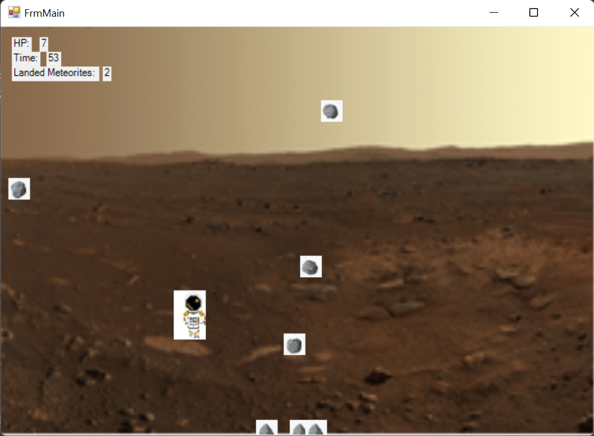

# SpaceGame

## Capturas:

## Requisitos:
* Tener Visual Studio 2017+ con C++ instalado
* PlatformToolset versión 142+ (no estoy seguro de si funciona en versiones anteriores)
## Instalación:
1. Descargar el código o ejecutar `git clone https://github.com/kurumii002/SpaceGame.git`
2. Compilar el proyecto
3. Probar el juego:)